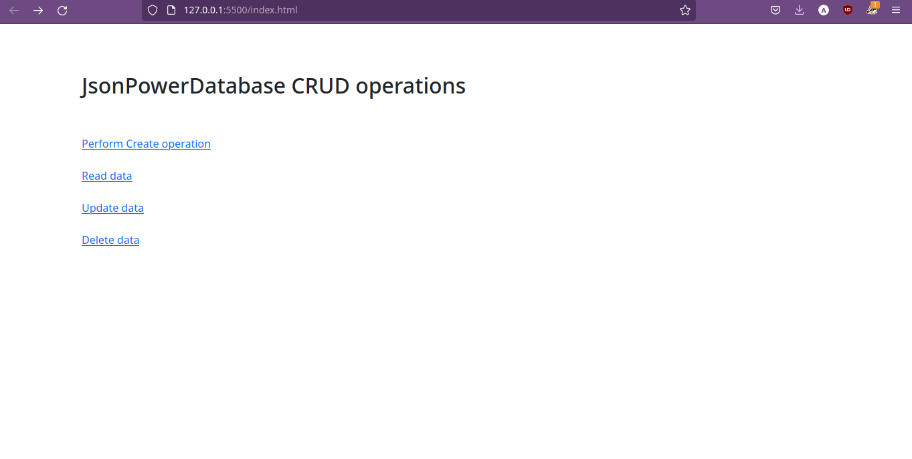
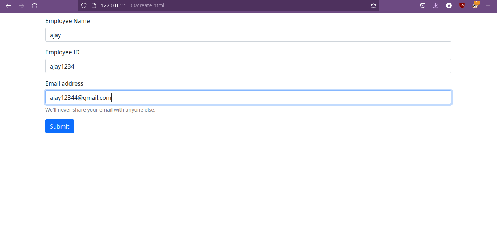
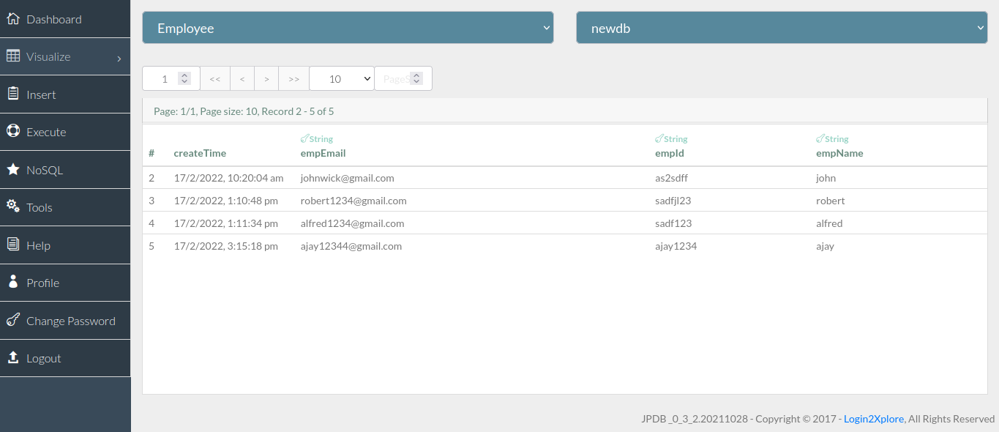
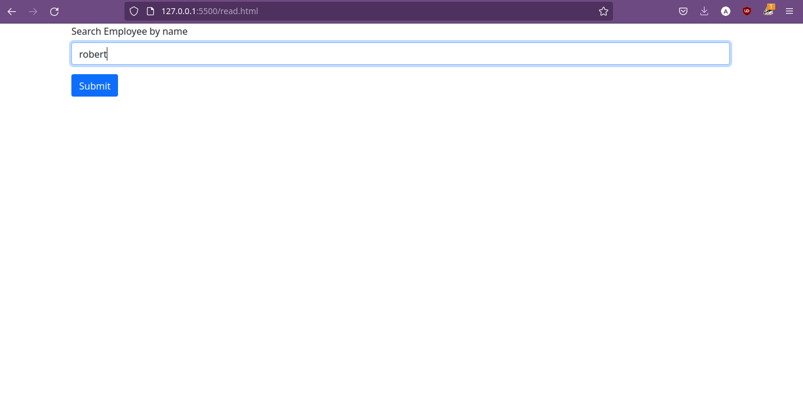
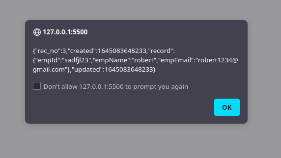
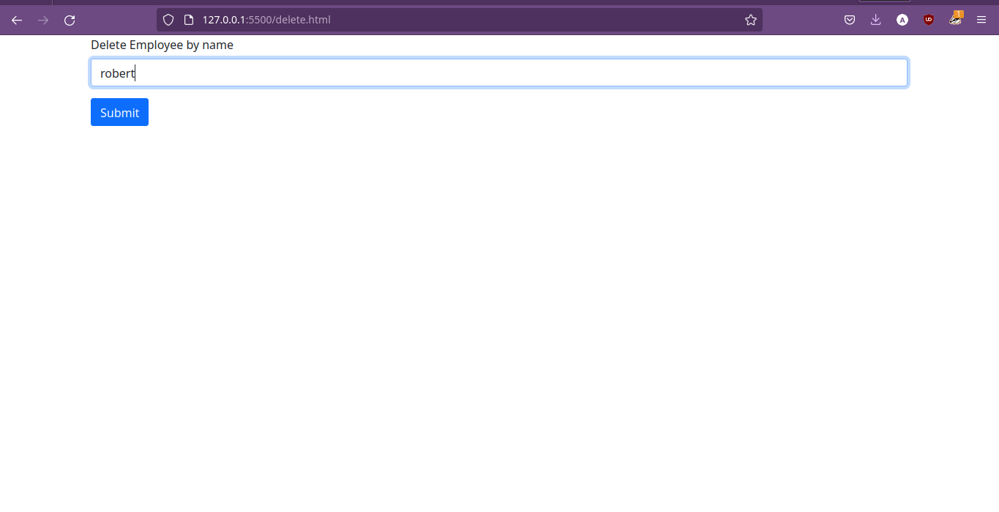
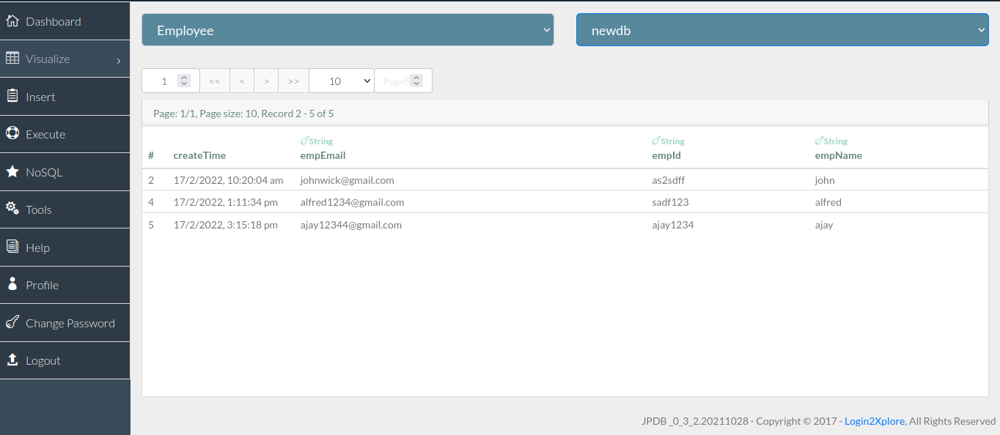

# JsonPowerdb.

## Title of the Project.

### JsonPower Database illustration

## Description
### JsonPowerDB is a Real-time, High Performance, Lightweight and Simple to Use, Serverless Multi-mode database. JsonPowerDB has ready to use API for Json document DB, RDBMS, Key-value DB, GeoSpatial DB and Time Series DB functionality. JPDB supports and advocates for true serverless and pluggable API development.

## Benefits of using JsonPowerDB 
- Proprietary algorithm for High Performance CRUD operations. Multiple times faster than popular DBMS.
- Serverless support for faster development - A UI developer can develop complete dynamic application.
- Schema free - easy to develop and maintain.
- Web-services API - Can be used with any programming language that has support for HTTP.
- Multiple security layers.
- Nimble, Simple to use, In Memory, Real-time DBMS.

## Illustrations
### Home page

### create task

### result

### read 

### result

### delete task

### result

## Project status 
### 80% complete , update task is still to be added .

## Sources
### [documentation](https://login2explore.com/jpdb/docs.html)
